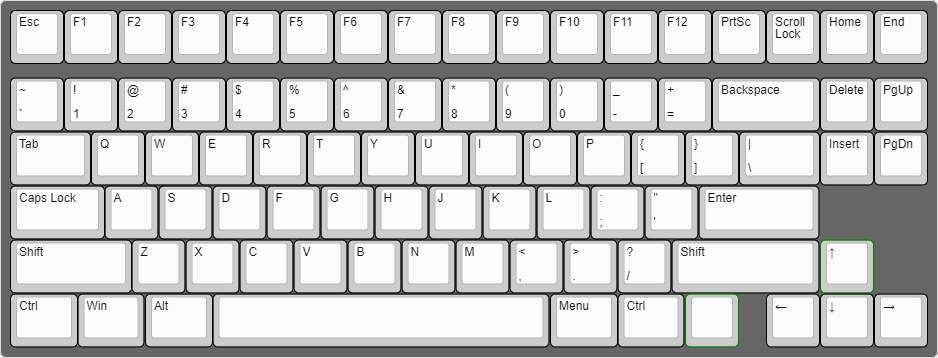

# Custom Keyboards

```bash
git clone https://github.com/HiIamChaitanya/custom-keyboard.git
```

---

## Project under Devlopment

---

## layout



---

## Parts List

- 16 Pin USB Type C Connector – SMD
- mechanical switches (of your choice)
- keycaps (of your choice)
- keycaps (of your choice)
- 0.2W RGB SMD LED

**_will update list soon_**

---

## Tools

- Soldering iron
- wire cutter
- screwdriver set
- solder wick
- soldering wire
- soldering paste
- solder sucker
- isopropyl alcohol
- kapton tape **(optional)**
- tweezers

---

## keyboard application (for windows & linux)

***electron js***


_under development_

---

[](https://github.com/tterb/atomic-design-ui/blob/master/LICENSEs)
