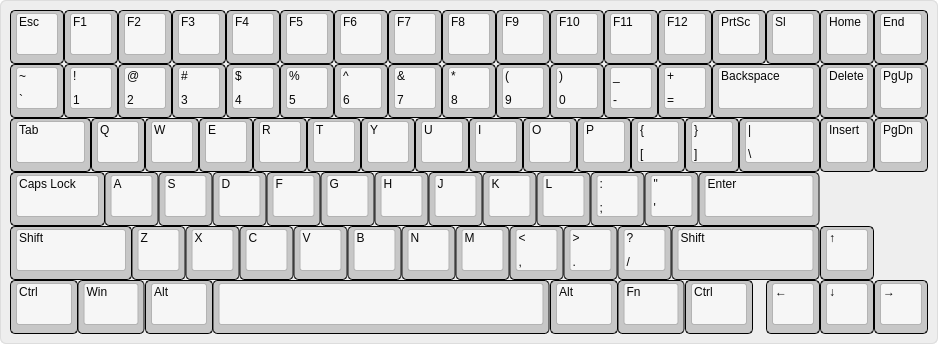

# Custom Keyboards

```bash
git clone https://github.com/HiIamChaitanya/custom-keyboard.git
```

---

## Project under Devlopment

---

## layout



---

## Parts List

- 16 Pin USB Type C Connector – SMD
- mechanical switches (of your choice)
- keycaps (of your choice)
- keycaps (of your choice)
- 0.2W RGB SMD LED
- microcontroller (STM32F030C8T6) - 32Bit ARM core, Embedded Microcontroller 64KB (64K x 8) FLASH 
**_will update list soon_**

---

## Tools

- Soldering iron
- wire cutter
- screwdriver set
- solder wick
- soldering wire
- soldering paste
- solder sucker
- isopropyl alcohol
- kapton tape **(optional)**
- tweezers

---


## datasheet for component's

- [mechanical switches](datasheet/mechanical-switches.pdf)
- [rgb led](datasheet/rgb-led-datasheet.pdf)
- [USB Type-C 16pin](datasheets/USB-Type-C-16pin-Datasheet.pdf)
- [microcontroller datasheet](datasheets/STM32F030C8T6-microcontroller-datasheet.pdf)


---
## Keyboard fermware
- [QMK firmware](https://github.com/qmk/qmk_firmware)
---
## keyboard application for windows & linux
under development

---

[](https://github.com/tterb/atomic-design-ui/blob/master/LICENSEs)
